% Documentation as a Code
% Igor Khorlo, Syneos Health
% June 28, 2018   PhUSE SDE  📍 Basel, Switzerland

# The problem

## Why do we need documentation?

- Standardize software usage
- Help users to get started
- Documents processes 

## How do you manage documentation?

- Do you use Microsoft Word?
- CMS?
- Sharepoint?

<!--  
## asd {data-background="assets/semantic-styles.png" width=50%}

---

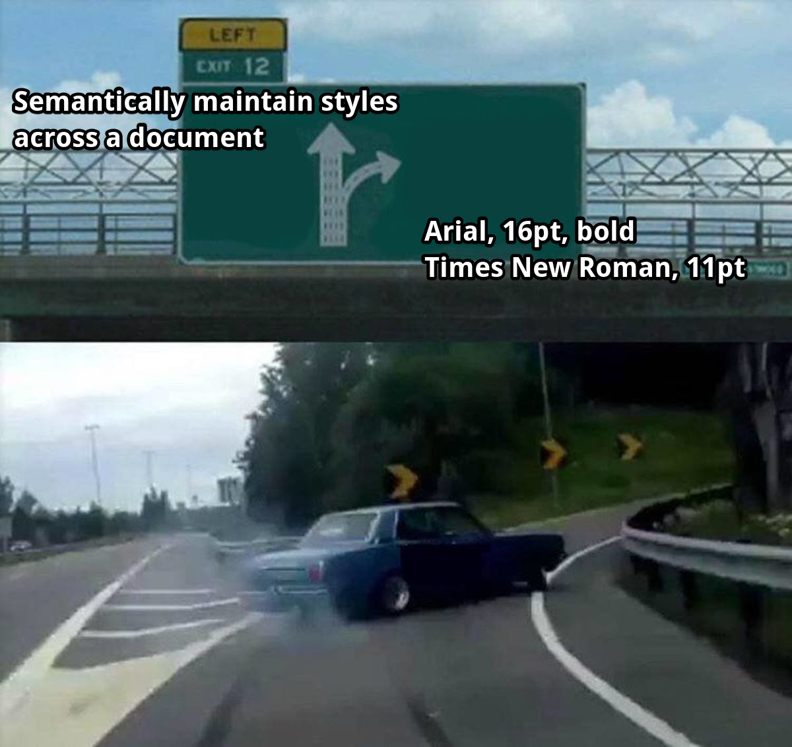{width=70%}
-->

---

**Right way**

- Semantically maintain styles across a document

**Wrong way**

- Arial, 16pt, bold
- Times New Roman, 11pt

## Disadvantages of [WYSIWYG](https://en.wikipedia.org/wiki/WYSIWYG) approach

<!-- 
Disadvantages of using Microsoft Word and similar [WYSIWYG](https://en.wikipedia.org/wiki/WYSIWYG) applications for Documentation:
-->

- Keeping content and styling together.
- Hard to review changes over many versions (track changes).
- Hard to maintain several formats at once: DOCX, PDF, etc.
- Very hard to collaborate.
- Hard to automate.

# Approach

## Separation of concerns

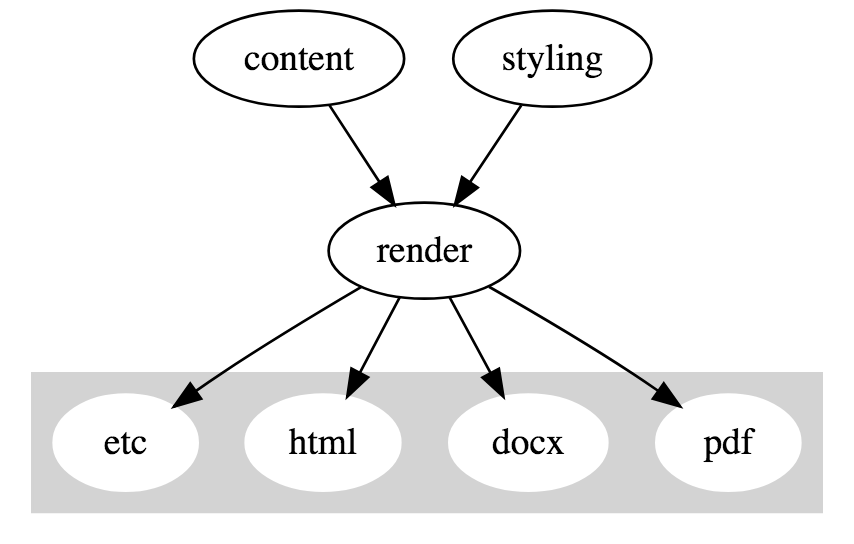

<!--
digraph G {
    subgraph cluster_0 {
        style=filled;
        color=lightgrey;
        node [style=filled,color=white];
        pdf; docx; html; etc;
    }
    
    content -> render
    styling -> render
    
    render -> pdf
    render -> docx
    render -> html
    render -> etc
}
-->

## [Write the Docs](http://www.writethedocs.org/)

<!-- TODO screenshot does not fit -->

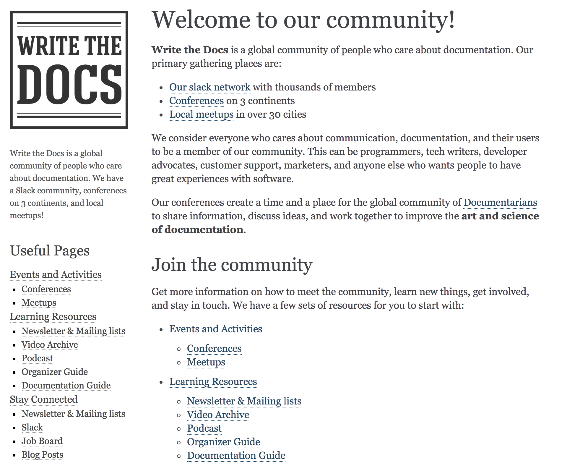{width=75%}

## [Its source](https://raw.githubusercontent.com/writethedocs/www/master/docs/index.rst)

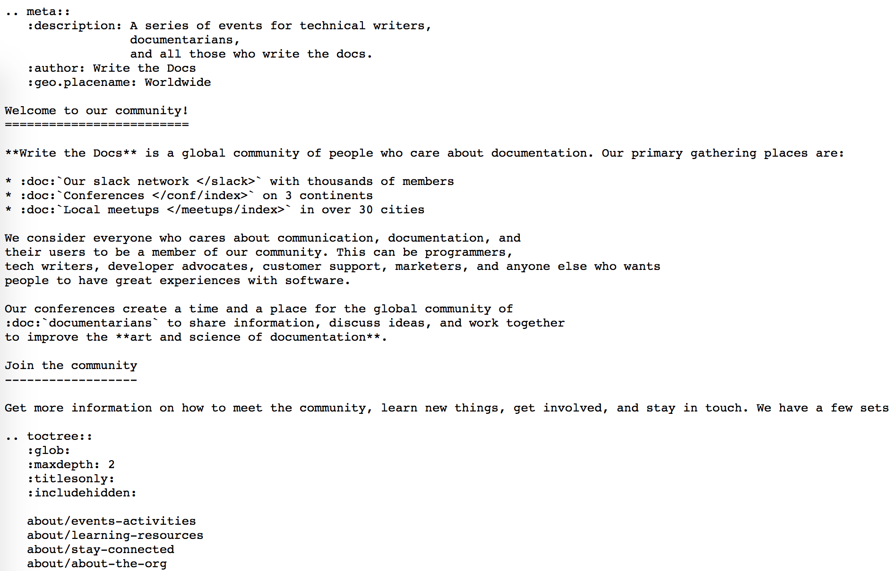{width=85%}

## [SAS Kernel for Jupyter](https://sassoftware.github.io/sas_kernel/overview.html)

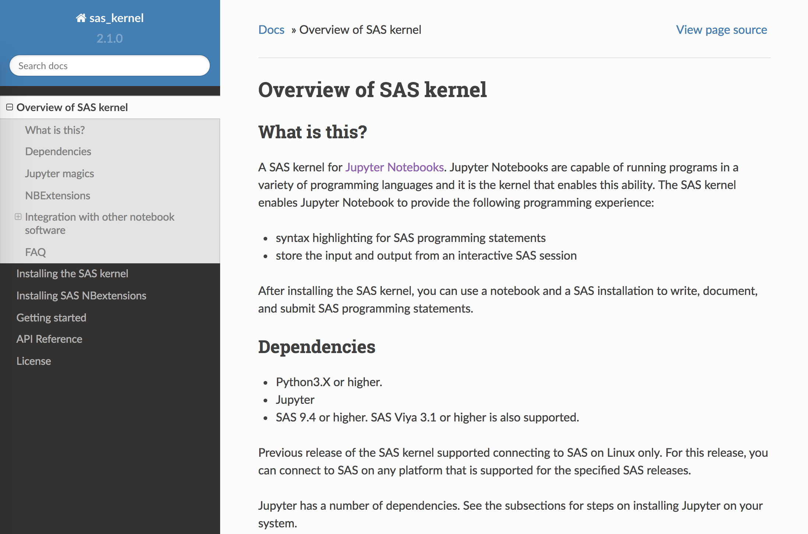{width=85%}

## [Its source](https://sassoftware.github.io/sas_kernel/_sources/overview.rst.txt)

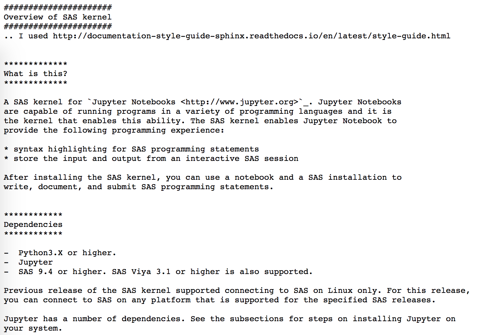{width=85%}

## Minus markup

<!-- TODO shadow -->

:::::::::::::: {.columns}
::: {.column width="50%"}

:::
::: {.column width="50%"}
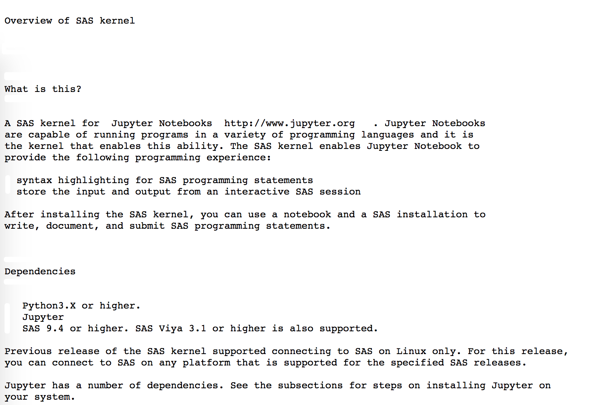
:::
::::::::::::::

## Markup languages

- Markdown
- reStructuredText
- Asciidoc

## Generators

- [sphinx](http://www.sphinx-doc.org/en/master/)
- [pandoc](http://pandoc.org/index.html)
- [AsciiDoc](http://www.methods.co.nz/asciidoc/)

# Benefits

---

- text editors (like [Sublime Text], [Vim], [Emacs], [Atom], [Visual Studio Code], [Brackets])
- version control systems ([Git], [Subversion][svn], [Mercurial][hg])
- automation via Continuous Integration/Continuous Deployment
    + spellcheck
    + post/pre processing

## [VCS Blame](https://gitlab.com/gitlab-com/www-gitlab-com/blame/master/source/handbook/git-page-update/index.html.md)

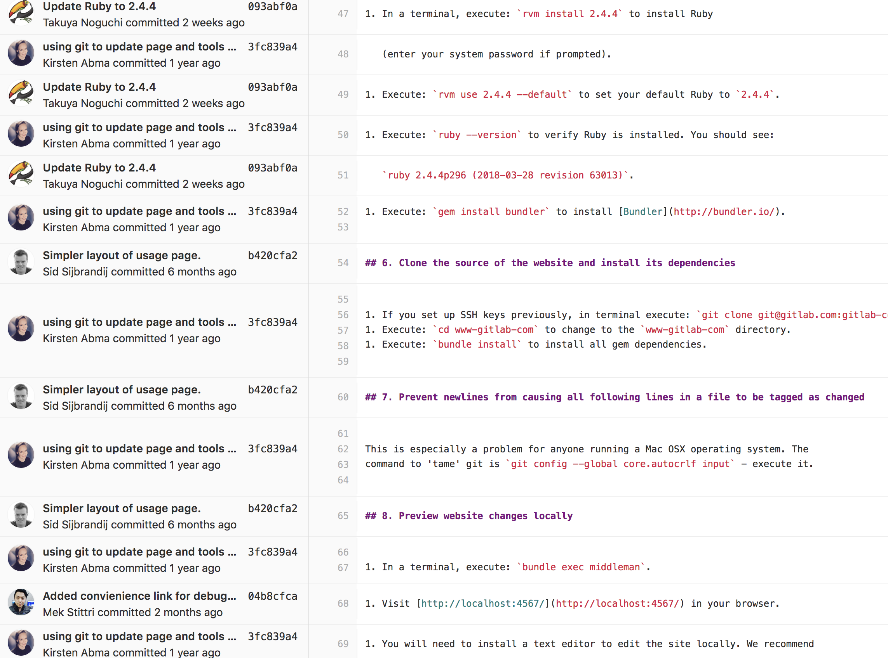{width=80%}

## [Pull requests](https://gitlab.com/gitlab-com/www-gitlab-com/merge_requests/12541/diffs?view=inline)

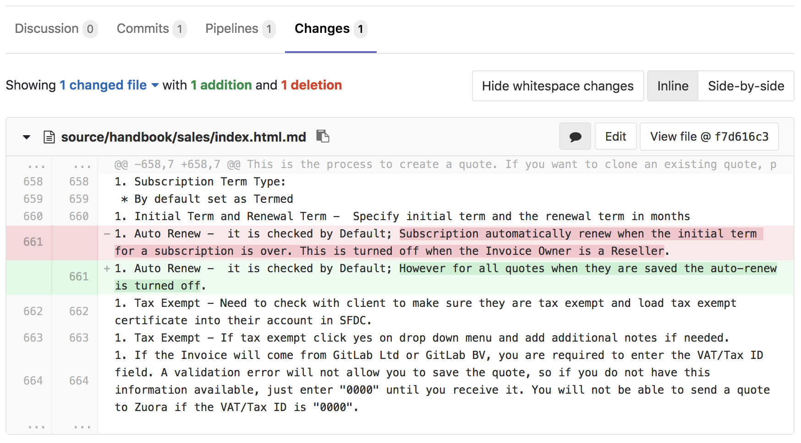

# Real world examples

## [GitLab](https://about.gitlab.com/) <!-- {data-background="assets/gitlab-main.gif"} -->

{width=90%}

## [GitLab Handbook](https://about.gitlab.com/handbook/)

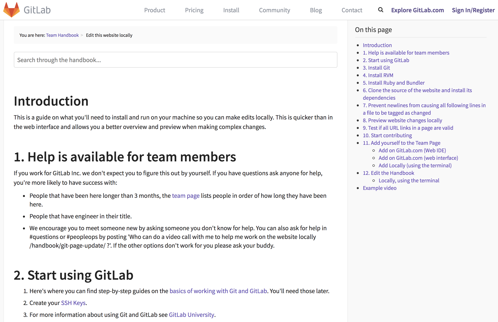{width=80%}

## [Amazon AWS S3 docs](https://docs.aws.amazon.com/AmazonS3/latest/gsg/OpeningAnObject.html)

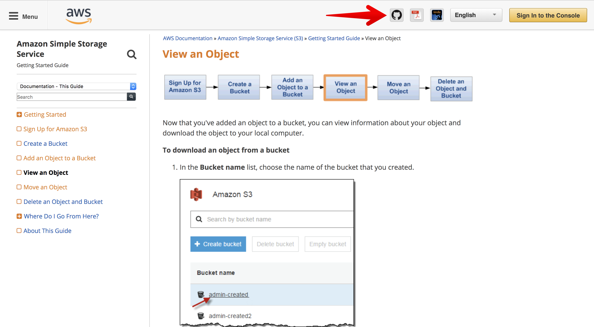

# The end

## Contact info

Igor Khorlo

<!-- {#syneos-logo width=30%} -->

[Syneos Health](https://www.syneoshealth.com/)

<https://www.linkedin.com/in/igor-khorlo-4546129a/>

igor.khorlo@syneoshelath.com

igor.khorlo@gmail.com

[Sublime Text]: https://www.sublimetext.com/
[vim]: https://en.wikipedia.org/wiki/Vim_(text_editor)
[emacs]: https://en.wikipedia.org/wiki/Emacs
[atom]: https://atom.io/
[Visual Studio Code]: https://code.visualstudio.com/
[brackets]: http://brackets.io/
[git]: https://git-scm.com/
[svn]: https://subversion.apache.org/
[hg]: https://en.wikipedia.org/wiki/Mercurial
