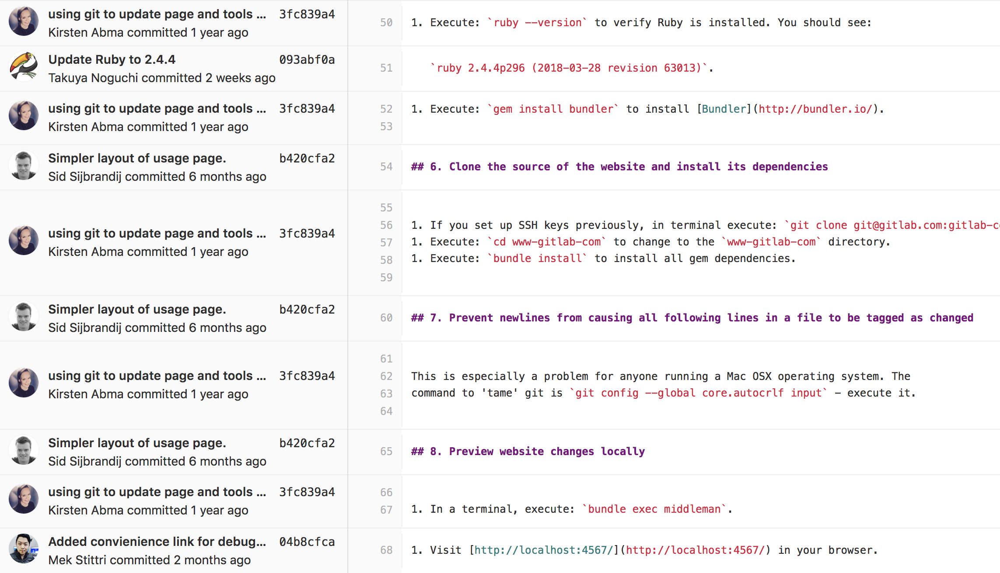

% Documentation <br> as a Code
% Igor Khorlo { width=200px style="background:none; border:none; box-shadow:none; vertical-align: middle;" }
% June 28, 2018 <br> PhUSE SDE <br>📍 Basel, Switzerland

# The problem

## Why do we need documentation?

- Standardize software usage
- Help users to get started
- Documents processes 

## How do you manage documentation?

- Do you use Microsoft Word?
- CMS?
- Sharepoint?

::: notes

A question to audience.

:::

<!--  
## asd {data-background="assets/semantic-styles.png" width=50%}

---

{width=70%}
-->

## { style="text-align:left;" }

**Right way**

- Semantically maintain styles across a document

**Wrong way**

- Arial, 16pt, bold
- Times New Roman, 11pt

## Disadvantages of [WYSIWYG](https://en.wikipedia.org/wiki/WYSIWYG) approach

<!-- 
Disadvantages of using Microsoft Word and similar [WYSIWYG](https://en.wikipedia.org/wiki/WYSIWYG) applications for Documentation:
-->

- Keeping content and styling together.
- Hard to review changes over many versions (track changes).
- Hard to maintain several formats at once: HTML, DOCX, PDF, etc.
- Very hard to collaborate.
- Hard to automate.

::: notes

- Keeping docs in sync with a codebase

:::

# Approach

## <a href="#" onclick="document.getElementById('theme').setAttribute('href','reveal.js/css/theme/black.css'); return false;">Separation</a> of <a href="#" onclick="document.getElementById('theme').setAttribute('href','reveal.js/css/theme/white.css'); return false;">concerns</a>

{ style="background:none; border:none; box-shadow:none;" width=1000px }


<!--
digraph G {
    subgraph cluster_0 {
        style=filled;
        color=lightgrey;
        node [style=filled,color=white];
        pdf; docx; html; etc;
    }
    
    content -> render
    styling -> render
    
    render -> pdf
    render -> docx
    render -> html
    render -> etc
}
-->

---

[{width=75%}](http://www.writethedocs.org/)

<!--

## [Its source](https://raw.githubusercontent.com/writethedocs/www/master/docs/index.rst)

{width=85%}

-->

---

```rst
Welcome to our community!
=========================

**Write the Docs** is a global community of people who care about documentation. Our primary gathering places are:

* :doc:`Our slack network </slack>` with thousands of members
* :doc:`Conferences </conf/index>` on 3 continents
* :doc:`Local meetups </meetups/index>` in over 30 cities

We consider everyone who cares about communication, documentation, and
their users to be a member of our community. This can be programmers,
tech writers, developer advocates, customer support, marketers, and anyone else who wants
people to have great experiences with software.

Our conferences create a time and a place for the global community of
:doc:`documentarians` to share information, discuss ideas, and work together
to improve the **art and science of documentation**.
```

---

```rst
You can `join our Slack <http://slack.writethedocs.org/>`_ if you aren't already a member.

.. note:: Feel free to send a Pull Request to update `this page`_, if you want to include other channels.

.. _this page: https://github.com/writethedocs/www/blob/master/docs/slack.rst

Default channels
----------------

Everyone who joins the Slack will be added to these channels:

* **#general** - The main channel for documentation related conversation and questions.
* **#watercooler** - For talking about things that are off-topic. Get to know folks other interests that aren't around documentation :)
* **#jobs-posts-only** - Posting or asking for jobs.
* **#wtd-conferences** - Questions and other thoughts around the :doc:`/conf/index`.
* **#meetups** - Questions and other thoughts about our :doc:`/meetups/index`.
* **#intros** - Introduce yourself! Let people know you're here, and why you care about docs :)
```

---

<!-- 
## [SAS Kernel for Jupyter](https://sassoftware.github.io/sas_kernel/overview.html)
 -->

[{width=90%}](https://sassoftware.github.io/sas_kernel/overview.html)

<!-- 
## [Its source](https://sassoftware.github.io/sas_kernel/_sources/overview.rst.txt)

{width=85%}
 -->

---

```rst
######################
Overview of SAS kernel
######################
.. I used http://documentation-style-guide-sphinx.readthedocs.io/en/latest/style-guide.html


*************
What is this?
*************

A SAS kernel for `Jupyter Notebooks <http://www.jupyter.org>`_. Jupyter Notebooks
are capable of running programs in a variety of programming languages and it is
the kernel that enables this ability. The SAS kernel enables Jupyter Notebook to
provide the following programming experience:
```

---

```rst
******************
Load data into SAS
******************

The FILENAME statement is used to specify an external file. The
IMPORT procedure can read data from a variety of external file formats.

.. code-block:: none

    filename x "./HR_comma_sep.csv";
    proc import datafile=x out=_csv dbms=csv replace; run;
```

---

```rst
Plot a heatmap that shows the relationship between employee
satisfaction and the last evaluation.

.. code-block:: none

    proc sgplot data=work._csv;
        heatmap x=last_evaluation y=satisfaction_level;
    run;

.. image:: ./images/heatmap_satisfaction_evaluation.png
   :scale: 60 %
   :alt: Heatmap of employee statisfaction and evaluation.
```

---

[{ width=35% }](https://sassoftware.github.io/sas_kernel/install.html#windows-install-assuming-sas-already-installed)

:::::::::::::: {.columns}
::: {.column width="50%"}

:::
::: {.column width="50%"}

:::
::::::::::::::

## Markup languages

- Markdown
- reStructuredText
- Asciidoc

## Generators

- [sphinx](http://www.sphinx-doc.org/en/master/)
- [pandoc](http://pandoc.org/index.html)
- [AsciiDoc](http://www.methods.co.nz/asciidoc/)
- [DocFX](https://dotnet.github.io/docfx/) — [example](https://eventstore.org/docs/server/users-and-access-control-lists/index.html?tabs=tabid-1%2Ctabid-3%2Ctabid-5#example), [src](https://github.com/EventStore/docs.geteventstore.com/blob/master/server/users-and-access-control-lists.md)
- [Jekyll](https://jekyllrb.com/)
- [Docusaurus](https://docusaurus.io/)
- google for [static site generators documentation](http://lmgtfy.com/?q=static+site+generators+documentation)

# Benefits

---

- text editors (like [Sublime Text], [Vim], [Emacs], [Atom], [Visual Studio Code], [Brackets])
- version control systems ([Git], [Subversion][svn], [Mercurial][hg])
- automation via Continuous Integration/Continuous Deployment
    + spellcheck
    + post/pre processing

::: notes

- Reusable snippets of code

:::

## [VCS Blame](https://gitlab.com/gitlab-com/www-gitlab-com/blame/master/source/handbook/git-page-update/index.html.md)

{width=80%}

## [Pull requests](https://gitlab.com/gitlab-com/www-gitlab-com/merge_requests/12541/diffs?view=inline)


# Real world examples

## [GitLab](https://about.gitlab.com/) <!-- {data-background="assets/gitlab-main.gif"} -->

{width=90%}

## [GitLab Handbook](https://about.gitlab.com/handbook/)

{width=80%}

## [Amazon AWS S3 docs](https://docs.aws.amazon.com/AmazonS3/latest/gsg/OpeningAnObject.html)


# The end

## Contact info

Igor Khorlo

[{ width=300px style="background:none; border:none; box-shadow:none;" }](https://www.syneoshealth.com/)

[https://www.linkedin.com/in/igor-khorlo-4546129a/](https://www.linkedin.com/in/igor-khorlo-4546129a/)

[igor.khorlo@syneoshealth.com](mailto:igor.khorlo@syneoshealth.com)

[igor.khorlo@gmail.com](mailto:igor.khorlo@gmail.com)

::: notes

General advise – You will have to spend some time to get used to it, but it will worth it in the end.

:::


[Sublime Text]: https://www.sublimetext.com/
[vim]: https://en.wikipedia.org/wiki/Vim_(text_editor)
[emacs]: https://en.wikipedia.org/wiki/Emacs
[atom]: https://atom.io/
[Visual Studio Code]: https://code.visualstudio.com/
[brackets]: http://brackets.io/
[git]: https://git-scm.com/
[svn]: https://subversion.apache.org/
[hg]: https://en.wikipedia.org/wiki/Mercurial
